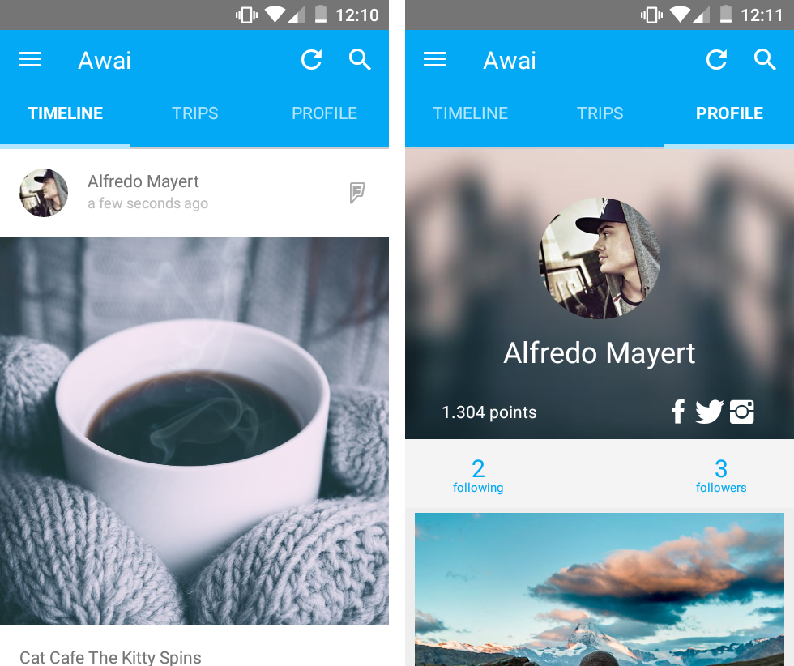
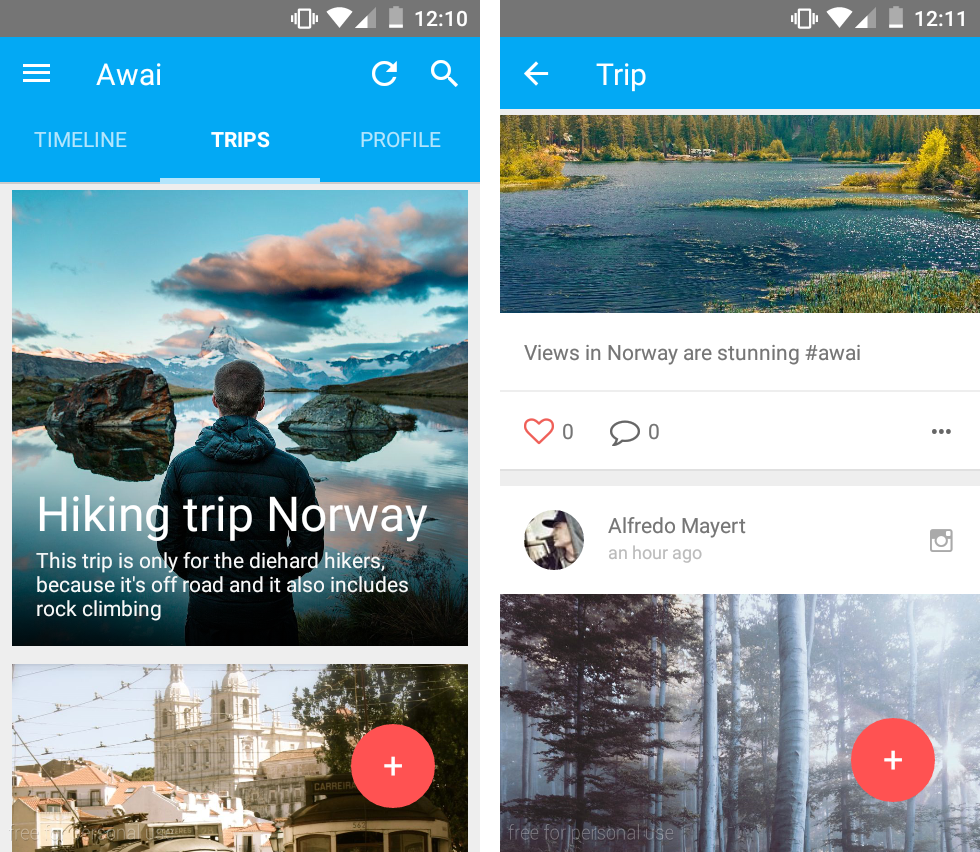
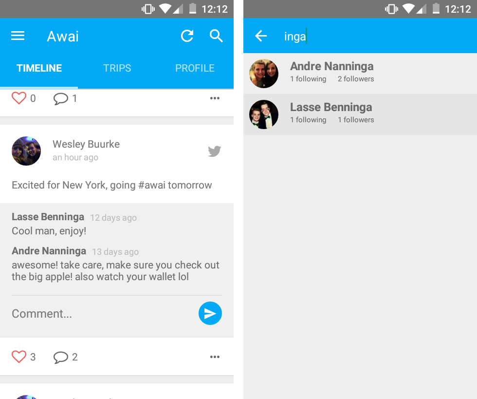

Awai is a social travel app. It centralizes all your social media into one single view for every trip you take. By using the hashtag _#awai_ in your Twitter, Facebook or Instagram post you can automatically add it to you Awai trips.

In the app you can follow your friends and see whatever they are up to when they are traveling. And when you go traveling yourself it provides an easy platform to keep a diary of your trip. In future version it might also suggest places to go based on other users' activity.

I created the app for this project using [React Native](https://facebook.github.io/react-native/) and [alt.js](http://alt.js.org/). The app was built for Android although with React Native it should be easily possible to port it to iOS. The design is based on the Google's [Material Design](https://www.google.com/design/spec/material-design) guidelines.

To create a more lively prototype we used photos from [Unsplash](https://unsplash.com/) and we found a nice (temporary) logo on [Logodust](http://logodust.com/). These free resources have proven to be invaluable to create a good looking prototype.

